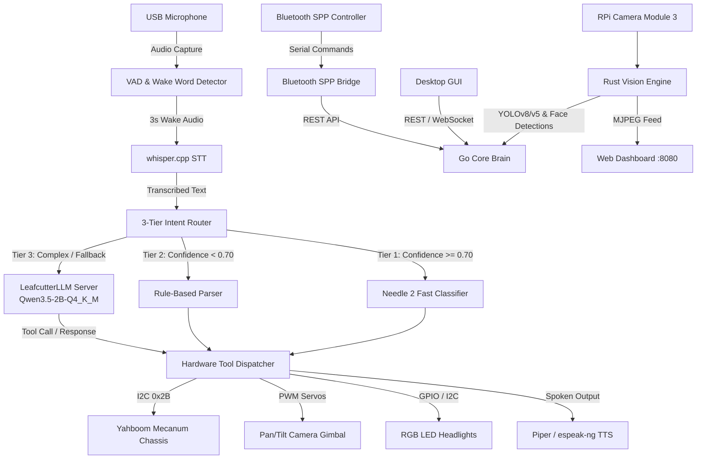

# 👁️ THE PATHFINDER EYE

[](https://golang.org)
[](https://www.rust-lang.org)
[-C51A4A?style=flat&logo=raspberry-pi)](https://www.raspberrypi.com/)
[](LICENSE)

**The Pathfinder Eye** is a fully offline, autonomous AI robotics platform built for edge exploration, wilderness guidance, and interactive patrol on a Raspberry Pi 5.

It integrates low-latency local speech recognition (Whisper), high-speed 3-tier intent classification (Needle 2 + Rule Parser + Qwen LLM), computer vision (YOLOv8/v5 dual detection & face tracking), Mecanum wheel drive kinematics over I2C, Bluetooth SPP serial control, and a Tkinter desktop GUI.

---

## 🚀 Key Features

- **100% Offline Edge Operation**: Zero cloud dependencies. Runs entirely on-device with sub-second voice command response times.
- **3-Tier Intent & Tool Calling Cascade**:
  1. **Tier 1 (Needle 2 Fast Intent)**: Sub-50ms JSON tool router for direct hardware invocation (Confidence $\ge 0.70$).
  2. **Tier 2 (Rule-Based Aliases)**: Deterministic regex/alias parser for instant command fallback.
  3. **Tier 3 (Local LLM Fallback)**: Qwen 3.5 2B/4B (GGUF via LeafcutterLLM) for natural conversation, deep reasoning, and complex queries.
- **8 Native Hardware Tools**:
  - `move` (forward, backward, left, right, rotate_left, rotate_right, about_turn, speed control)
  - `stop` (instant emergency brake)
  - `look` (pan/tilt servo gimbal control)
  - `light` (RGB headlight modes and brightness)
  - `play_resource` (audio playback of organization anthems & soundscapes)
  - `read_document` (speech synthesis of Pathfinder Law, Pledge, Aim, Motto)
  - `activate` / `deactivate` (patrol, security sentry, vision tracking, translation modes)
- **Real-Time Computer Vision Engine (Rust + OpenCV)**:
  - Dual YOLOv8n and YOLOv5s detection with automatic output tensor format detection and Batched NMS.
  - Face detection & 2-DOF Pan/Tilt target centering.
  - MJPEG video streaming server.
- **Multi-Modal Control Interfaces**:
  - Voice Commands (Whisper `ggml-small.bin` + Piper/espeak TTS).
  - Desktop GUI (`desktop_gui.py` via Tkinter).
  - Bluetooth SPP Serial Bridge (`bluetooth_spp_bridge.py` @ 115200 baud).
  - REST & WebSocket API + Web Dashboard (`http://<pi-ip>:8080`).

---

## 🏛️ System Architecture



---

## ⚙️ Hardware Specifications & Pinouts

| Component | Specification / Address | Function |
|---|---|---|
| **SBC** | Raspberry Pi 5 (8GB RAM) | Core compute, LLM, STT, Vision |
| **Chassis** | Yahboom 4WD Mecanum Wheel Robot | Omnidirectional movement |
| **Motor & Servo Controller** | I2C Address `0x2B` (Bus 1) | Motor speeds, PWM pan/tilt servos |
| **Camera** | Raspberry Pi Camera Module 3 (IMX708) | 1080p stream, YOLOv8 object & face tracking |
| **Microphone** | USB Noise-Cancelling Array | 16kHz mono audio input |
| **Speaker** | USB / 3.5mm Amplified Speaker | Local speech synthesis and alerts |
| **Storage** | 64GB+ MicroSD (Class 10 U3 / A2) | OS, models, and DENDRITE graph database |

---

## 📦 Quickstart & Installation

### 1. Automated System Setup

Clone the repository to `/home/pi/the-pathfinder-eye_ai` on your Raspberry Pi:

```bash
git clone https://github.com/Alartist40/the-pathfinder-eye.git /home/pi/the-pathfinder-eye_ai
cd /home/pi/the-pathfinder-eye_ai
chmod +x setup-pi.sh FINISH_INSTALL.sh READY_TO_GO.sh
./setup-pi.sh
```

`setup-pi.sh` will:
- Install system dependencies (OpenCV, I2C, ALSA, build tools, Go 1.23, Rust).
- Build `whisper.cpp` shared libraries and download `ggml-small.bin`.
- Build `llama.cpp` and compile the `LeafcutterLLM` Rust FFI server.
- Build the Go core brain (`go build -o ../brain .`).
- Build the `rust_vision` detection engine.
- Configure systemd service units.

### 2. Model Installation

Place the recommended models into `models/`:
- **LLM**: `models/Qwen3.5-2B-Q4_K_M.gguf` (Default, ~1.5 GB)
- **STT**: `models/ggml-small.bin` (Default, ~500 MB)
- **Vision**: `models/yolov8n.onnx` or `models/yolov5s.onnx`

### 3. Service Management

```bash
# Start AI LLM engine
sudo systemctl start leafcutter

# Start robot brain
sudo systemctl start pathfinder-eye

# Check status
sudo systemctl status pathfinder-eye leafcutter
```

---

## 🎙️ Voice Commands & Audio Policy

The robot operates strictly under the **3s Wake / 5s Command** window defined in `AUDIO_POLICY.md`:

- **Wake Words**: `"hey pathfinder"`, `"pathfinder"`, `"eye"`, `"computer"`
- **Response Flow**:
  1. Wake word detected $\to$ Robot plays chime and begins 5-second command recording.
  2. Command transcribed by Whisper STT.
  3. Routed through 3-tier cascade and executed.
  4. Audio output synthesized via TTS.

### Common Voice Commands

| Category | Example Phrases |
|---|---|
| **Movement** | *"Move forward"*, *"Go back half speed"*, *"Turn around"* (*"About turn"*), *"Strafe left"*, *"Stop immediately"* |
| **Camera** | *"Look up"*, *"Look center"*, *"Look left"*, *"Tilt down"* |
| **Lighting** | *"Turn on headlights"*, *"Lights red"*, *"Strobe lights"*, *"Lights off"* |
| **Documents** | *"Read the Pathfinder Law"*, *"Read the Pledge"*, *"Recite the Aim"*, *"Motto"* |
| **Resources** | *"Play Pathfinder song"*, *"Play Adventurer song"*, *"Play nature sounds"* |
| **Autonomous Modes** | *"Activate patrol mode"*, *"Start security sentry"*, *"Follow my face"*, *"Deactivate patrol"* |
| **General AI** | *"What plants are poisonous to touch?"*, *"How do I find North with a shadow stick?"* |

---

## 🎮 Desktop GUI & Bluetooth Control

### Desktop GUI (Tkinter)

Run the remote or on-device GUI control panel:

```bash
python3 desktop_gui.py
```

- **Features**: Live telemetry (CPU, RAM, Temp, Battery), WASD & Strafe directional buttons, Pan/Tilt sliders, RGB light selector, Mode toggles, and Systemd service controls.

### Bluetooth SPP Serial Bridge

Run the serial bridge on the Pi to accept wireless commands over RFCOMM / Bluetooth Serial (e.g. from an Android Bluetooth Terminal or custom remote):

```bash
python3 bluetooth_spp_bridge.py
```

- Default baud rate: `115200`
- Supported commands: `FORWARD`, `BACKWARD`, `LEFT`, `RIGHT`, `STOP`, `LIGHTS_ON`, `LIGHTS_OFF`, `PATROL_ON`, `PATROL_OFF`, etc.

---

## 📡 REST API Reference

The Go core brain exposes a REST API on port `8080`:

| Endpoint | Method | Payload | Description |
|---|---|---|---|
| `/health` | `GET` | — | System health, uptime, and module status |
| `/api/drive` | `POST` | `{"direction":"forward","speed":80}` | Motor movement command |
| `/api/stop` | `POST` | `{}` | Emergency stop all motors |
| `/api/gimbal` | `POST` | `{"pan":90,"tilt":45}` | Pan/Tilt camera servo position |
| `/api/lights` | `POST` | `{"mode":"solid","color":"#00FF00"}` | RGB lighting control |
| `/api/mode` | `POST` | `{"mode":"patrol","active":true}` | Activate / deactivate autonomous modes |
| `/api/command` | `POST` | `{"text":"look up and flash lights"}` | Direct text command ingestion |

---

## 📂 Repository Structure

```
.
├── go_brain/                 # Go Core Brain (State machine, I2C, 3-tier router, tools, API)
│   ├── main.go               # Entry point and supervisor loop
│   ├── voice_commands.go     # Audio processing, 3-tier routing cascade
│   ├── needle_intent.go      # Needle 2 JSON tool calling integration
│   ├── command_parser.go     # Fast rule-based alias parser
│   ├── tools.go              # 8 Native hardware tool implementations
│   ├── hardware.go           # I2C bus 1 Yahboom protocol driver
│   ├── server.go             # HTTP & WebSocket server
│   └── dendrite.go           # Local knowledge graph & memory store
├── LeafcutterLLM/            # Rust LLM Inference Server (llama.cpp FFI)
├── rust_vision/              # Rust Computer Vision Engine (YOLOv8/v5, Face tracking)
├── config/                   # Tool schemas & system configuration
│   └── needle_tools.json     # Needle 2 tool definitions (8 tools)
├── resources/                # Runtime documents & audio resources
│   ├── pathfinder_law.md     # Pathfinder Law text
│   ├── pathfinder_pledge.md  # Pathfinder Pledge text
│   ├── pathfinder_aim.md     # Pathfinder Aim text
│   └── pathfinder_motto.md   # Pathfinder Motto text
├── desktop_gui.py            # Tkinter Desktop GUI dashboard & control panel
├── bluetooth_spp_bridge.py   # Bluetooth SPP RFCOMM to REST serial bridge
├── AUDIO_POLICY.md           # Audio timing & wake word constraints
├── RECOVERY.md               # Complete SD card flashing & disaster recovery guide
├── instructions.md           # Operational manual & developer handbook
├── setup-pi.sh               # Master installation script
├── FINISH_INSTALL.sh         # Dependency verification & finalize script
└── READY_TO_GO.sh            # Production startup script
```

---

## 📜 License

This project is licensed under the MIT License - see the [LICENSE](LICENSE) file for details.
